_O surgimento do Comitê de Bolsistas do Insper está carinhosamente documentado nessa página. Recomendamos a leitura na íntegra._

---

## A carta que deu início a tudo

No dia **25 de junho de 2021**, foi enviado por Lister (na época no segundo semestre da Eng. de Computação) a seguinte **carta ao Programa de Bolsas do Insper** propondo a criação de algum tipo de _"Diretório de Apoio ao Bolsista":_

<iframe src="https://www.slideshare.net/slideshow/embed_code/key/tEF9qiAfjpzJPG?hostedIn=slideshare&page=upload" width="720" height="800" frameborder="0" marginwidth="0" marginheight="0" scrolling="no"></iframe>

Poucas horas após o envio da carta, a Carol (Gerente de Relacionamento Institucional do Insper) respondeu o e-mail elogiando a ideia e propondo uma conversa para decidir como tudo deveria ser implementado:

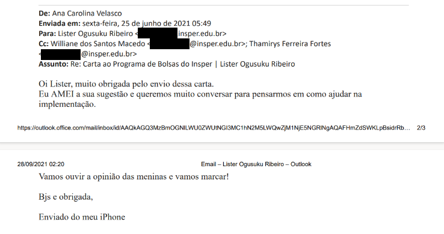

## De "Diretório de Apoio ao Bolsista" para "Comitê de Bolsistas"

Três dias após o envio da carta, **Carol e Williane** _(na época Coordenadora do Programa de Bolsas do Insper)_ se reuniram virtualmente com Lister para discutir um pouco melhor sobre **como seria a implementação do projeto** e foi trazida pela Carol a sugestão de que, ao invés de ser um _"Diretório de Apoio ao Bolsista"_, fosse desenvolvido um _"Comitê de Bolsistas"._ Carol trouxe essa sugestão com base em uma conversa que ela teve com o MultiInsper após levar a ideia do projeto até eles.

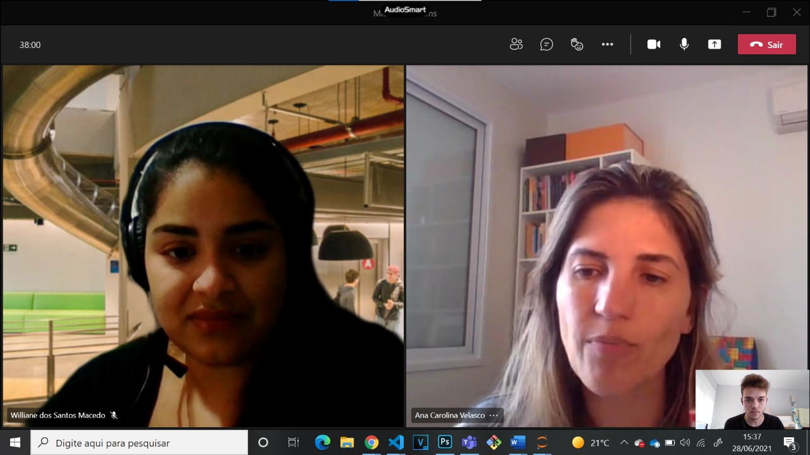

Após essa reunião, Lister recebeu o aval para procurar bolsistas integrais e parciais que pudessem se interessar em apoiar e desenvolver melhor o Comitê. A primeira lista de aderintes pode ser conferida abaixo:

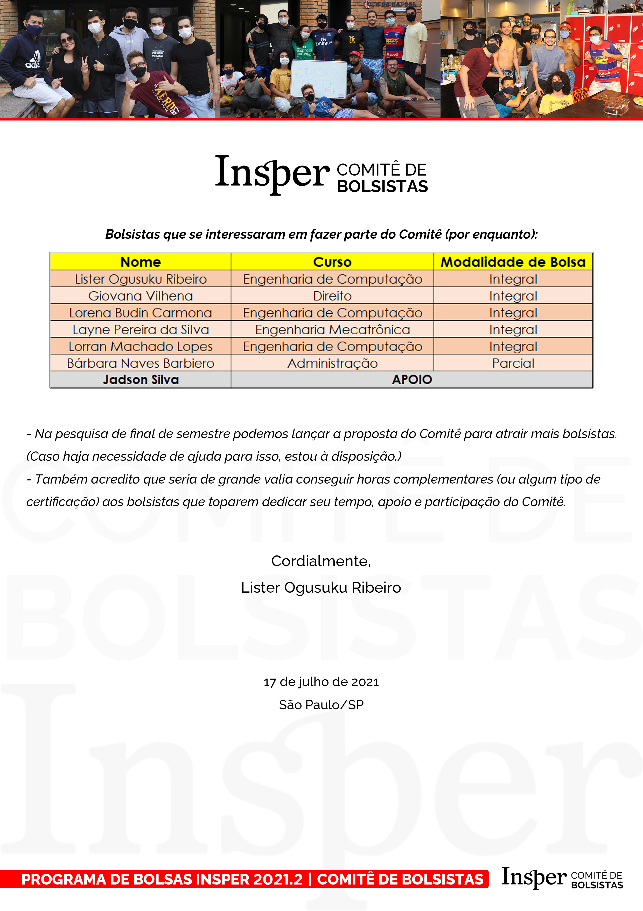

Lister ainda trouxe a sugestão de conseguir horas complementares aos membros que se dispuseram a dar prosseguimento ao projeto e assim, de fato, foi feito. **Até os dias atuais todos os membros do Comitê recebem horas complementares de acordo com sua atuação e proatividade dentro da organização.**

E **assim foi o pontapé inicial para o surgimento do Comitê.** Graças ao apoio da Carol, o Comitê também conseguiu um e-mail próprio e um logotipo poucos dias após a ideia ter sido levada pra frente.

---

## As primeiras atividades do Comitê

Logo nos seus primeiros meses de atuação, o Comitê foi o responsável por algumas atividades que podem ser conferidas a seguir:

- No dia 21 de julho de 2021, foi feito um _"trote"_ de boas-vindas aos novos bolsistas da graduação. O Programa de Bolsas convidou os membros do Comitê e outros bolsistas para se passarem por avaliadores dos candidatos e, no meio da ligação, todos foram direcionados à sala principal do Zoom para receberem a notícia de que, na verdade, **o Insper havia concedido a bolsa de estudos para todos ali presentes.**

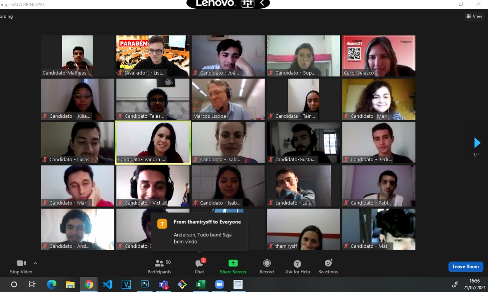
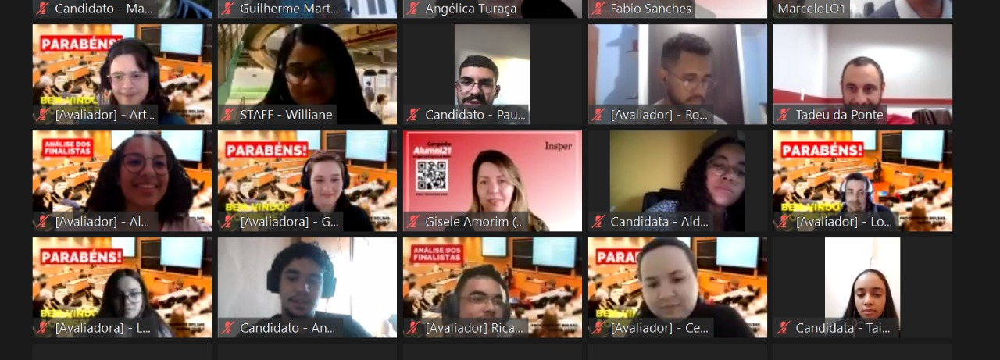

- Na semana seguinte, também foi responsabilidade dos membros do Comitê a **condução do bate-papo com os novos bolsistas da graduação ingressantes no 2º semestre de 2021:**

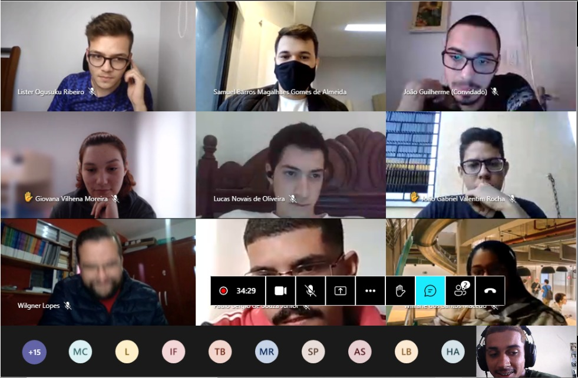

- No mês seguinte, foi de responsabilidade do Comitê a elaboração de uma **homenagem ao fundador do Insper e precursor do Programa de Bolsas, Claudio Haddad.** A homenagem foi conduzida por Lister Ogusuku Ribeiro e Samuel Barros no dia 25 de agosto de 2021.

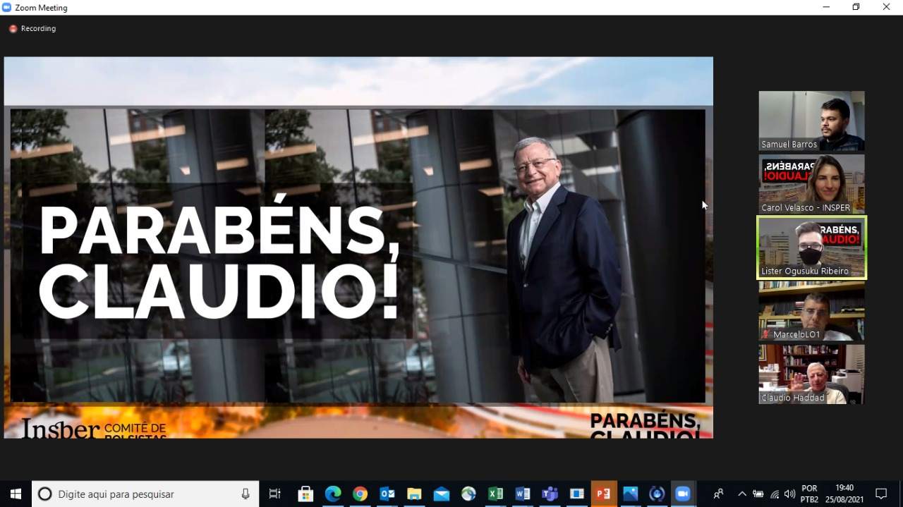

## A primeira estrutura do Comitê

- Em setembro de 2021 temos o registro de uma das reuniões que realizamos para definir, dentre outras coisas, **quais seriam os próximos passos a serem seguidos pelo Comitê:**

Nessa reunião foi elaborada, inclusive, a **primeira estrutura organizacional do Comitê**, a qual pode ser conferida a seguir:

**_1. Apoio Acadêmico:_**

- Hudson Monteiro (Eng. de Computação)

- João Gabriel Valentim Rocha (Eng. de Computação)

- Lorran Caetano Machado Lopes (Eng. de Computação)

- Wilgner Lopes (Eng. Mecatrônica);

**_2. Comunicação Externa:_**

- Bárbara Naves Barbiero (Administração)

- Samuel Barros (Economia);

**_3. Eventos e Mídias:_**

- Layne Silva (Eng. Mecatrônica)

- Lorena Budin Carmona (Eng. de Computação)

- Samuel Barros (Economia);

**_4. Relacionamento Institucional:_**

- Giovana Vilhena (Direito)

- José Edson Mendonça (Eng. Mecânica)

- Lister Ogusuku Ribeiro (Eng. de Computação)

## O lançamento oficial do Comitê de Bolsistas

Após a definição de toda a estrutura organizacional, **no dia 25 de novembro de 2021** foi feito o **lançamento oficial do Comitê para todos os bolsistas da graduação do Insper:**

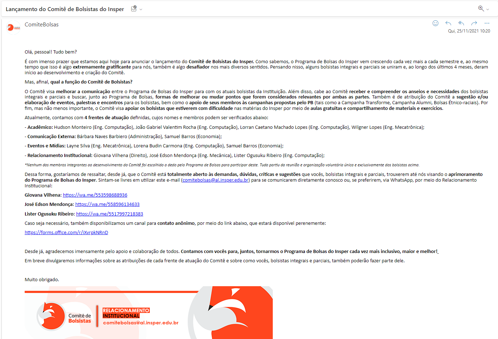

_Antes de prosseguir, gostaríamos de deixar aqui registrada toda nossa ***eterna gratidão a todos os membros acima apresentados e também a equipe do RI do Insper e Programa de Bolsas***, os quais foram de grande valia à criação e consolidação do Comitê de Bolsistas do Insper. Sem vocês não teríamos conseguido montar a base para chegar tão longe._

---

## O Comitê em 2022: um ano de muitos desafios

Em um processo de constante busca pela sua consolidação em meio a Comunidade Bolsista, o ano de 2022 foi extremamente desafiador para o Comitê e seus membros.

### A primeira pesquisa oficial do R.I.

- Em janeiro de 2022, durante as férias, foram recebidas mensagens de bolsistas integrais e parciais sobre uma demanda que havia surgido entre os estudantes e, visando entender um pouco melhor a situação, foi realizada uma pesquisa pela Diretoria de Relacionamento Institucional que levou semanas para ser concluída, consolidada e apresentada ao Insper. Como o conteúdo da pesquisa é de caráter interno, não há como deixar as informações sensíveis expostas, por isso a maior parte dos trechos no documento a seguir foi censurada.

<iframe src="https://www.slideshare.net/slideshow/embed_code/key/IGFjYvXzlcbdQk?hostedIn=slideshare&page=upload" width="600" height="880" frameborder="0" marginwidth="0" marginheight="0" scrolling="no"></iframe>

### Um freezer para a Toca

- Logo no início do semestre, o Comitê recebeu em seu e-mail institucional uma mensagem de um estudante morador da Toca relatando que **duas das geladeiras haviam quebrado** e a assistência técnica para manutenção estava **demorando mais que o normal.** Após esse relato, os membros do Relacionamento Institucional do Comitê buscaram **entender melhor o problema** e viram que a Toca necessitava de um freezer para dar conta das necessidades dos atuais moradores do residencial. Após isso, Giovana Vilhena e Lister Ogusuku Ribeiro começaram a **acionar contatos para buscar doações e descontos** para a aquisição de um novo freezer para a Toca. **Após 1 mês de campanhas com apoio de toda Comunidade Bolsista foi levantado o valor necessário e a Giovana também conseguiu um desconto por intermédio de um membro da Comunidade Alumni do Insper.**

  _Na imagem a seguir deixamos registrado o dia em que o novo freezer chegou na Toca e os líderes do residencial na época nos convidaram para prestigiar esse momento:_

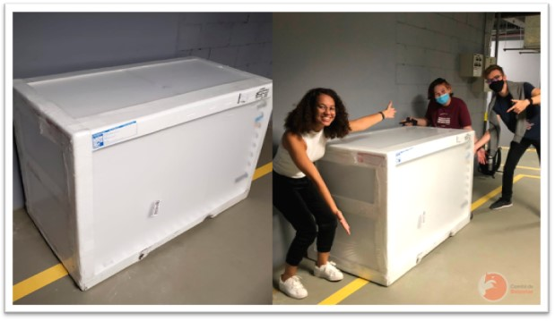

### O primeiro evento do Comitê

- No primeiro semestre de 2022, também realizamos nosso **primeiro evento oficial**, o qual contou com a presença de **33 bolsistas** e também membros da Diretoria do Insper e do Programa de Bolsas.

<iframe width="1351" height="480" src="https://www.youtube.com/embed/AYxQzWVNiR8" title="Evento Liderança e Diversidade - Comitê de Bolsistas do Insper" frameborder="0" allow="accelerometer; autoplay; clipboard-write; encrypted-media; gyroscope; picture-in-picture; web-share" allowfullscreen></iframe>

### Apoio Acadêmico fazendo a diferença por meio das aulas solidárias

- Algo que o Comitê sempre se preocupou muito foi com o **apoio acadêmico dado aos bolsistas**, sobretudo aos pertencentes ao ciclo básico das engenharias, os quais costumam demonstrar maior dificuldade acadêmica. Assim sendo, sempre foi uma grande preocupação o oferecimento de **aulas solidárias, monitorias e materiais de suporte** a esses estudantes. Algumas das aulas solidárias oferecidas no ano de 2022 podem ser conferidas a seguir:

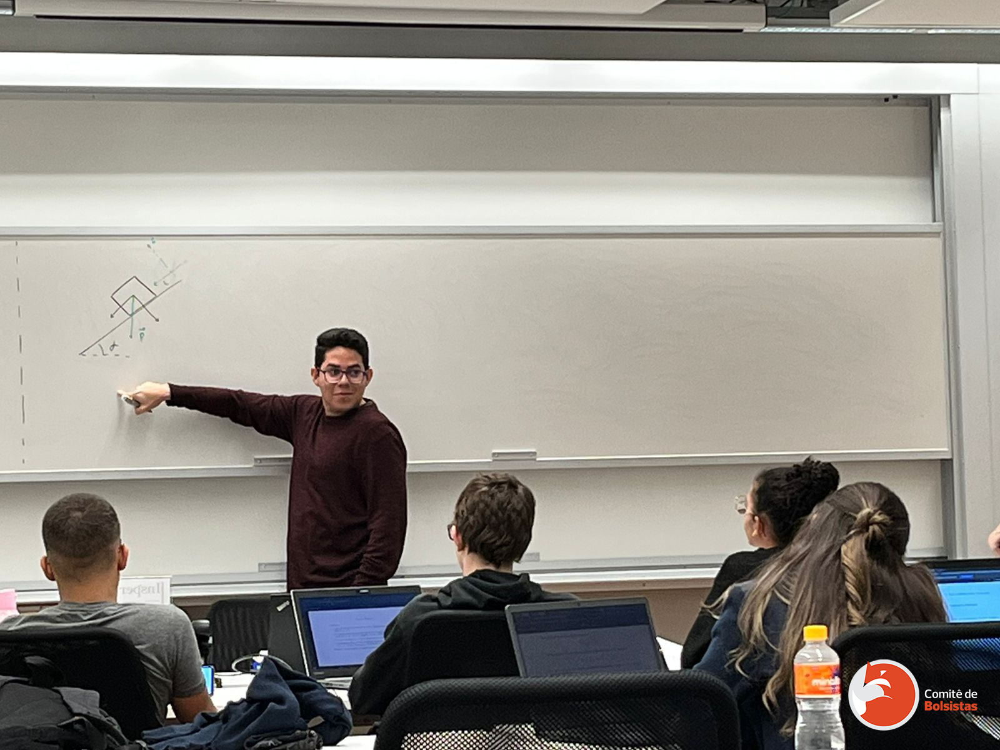
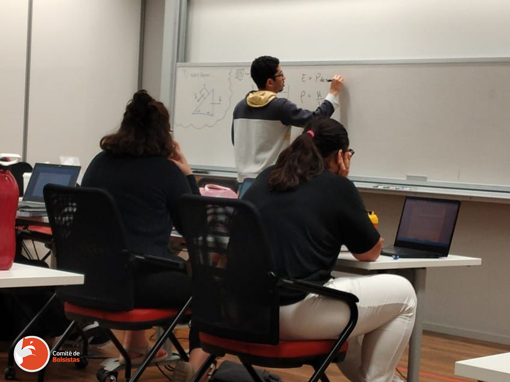
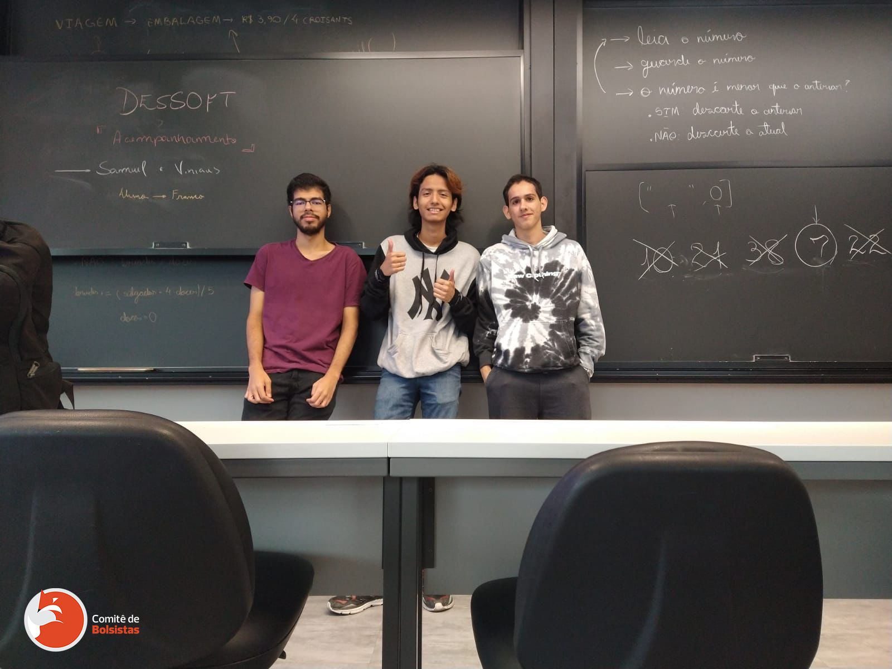
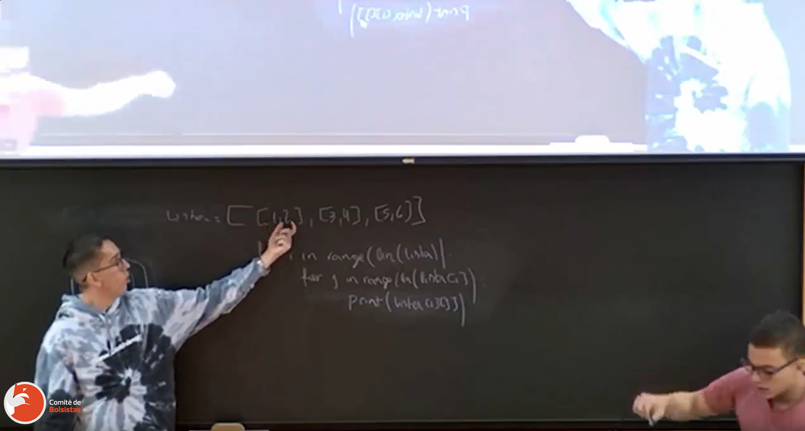

### O segundo evento do Comitê

No dia 26 de outubro de 2022 foi realizado o evento "Como conquistar seu espaço no mercado de trabalho?" com a professora Sônia Lota promovido pela a área de Eventos e Mídias do Comitê de Bolsistas.

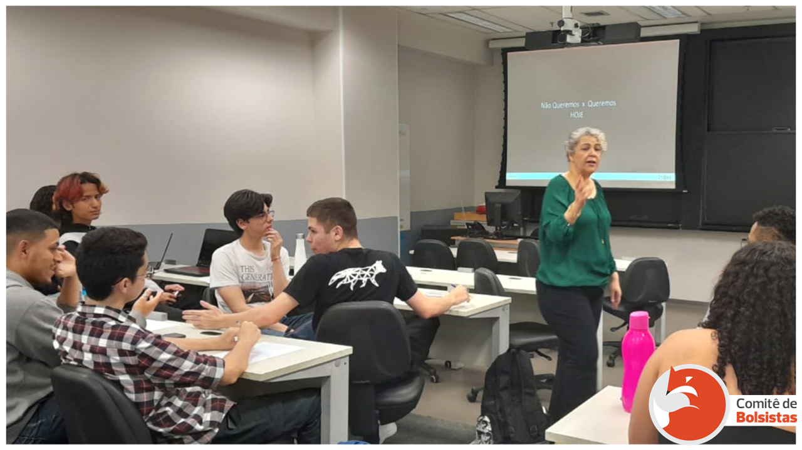

## A reestruturação do Comitê e escrita do estatuto

Ao longo desse ano cheio de desafios e realizações muito importantes, **tornou-se evidente que a estrutura organizacional do Comitê funcionava até certo ponto, mas ainda assim possuía algumas falhas.** Todas as falhas convergiam na mesma direção: **era necessário reestruturar todas as áreas, delegar melhor as tarefas e desenvolver um estatuto para o Comitê.** **_E assim foi feito._**

Durante o final de 2022 e início de 2023, o fundador do Comitê de Bolsistas, Lister Ogusuku Ribeiro, redigiu todo o **estatuto** da organização e **formou a nova Diretoria** responsável pela **gestão do Comitê em 2023.**

O **estatuto original** lançado em **1 de março de 2023** pode ser conferido na íntegra a seguir:

<iframe src="https://www.slideshare.net/slideshow/embed_code/key/tYkbUZEUVcOHUr?hostedIn=slideshare&page=upload" width="720" height="720" frameborder="0" marginwidth="0" marginheight="0" scrolling="no"></iframe>

**Com o lançamento do novo estatuto, definição e formalização da nova Diretoria e com o apoio do Programa de Bolsas do Insper, o Comitê estava, enfim, perenizado dentro do Insper.**

## A nova estrutura do Comitê de Bolsistas

A imagem a seguir demonstra como ficou a estrutura final do Comitê de Bolsistas lançada em 2023 e amparada pelo seu novo estatuto:

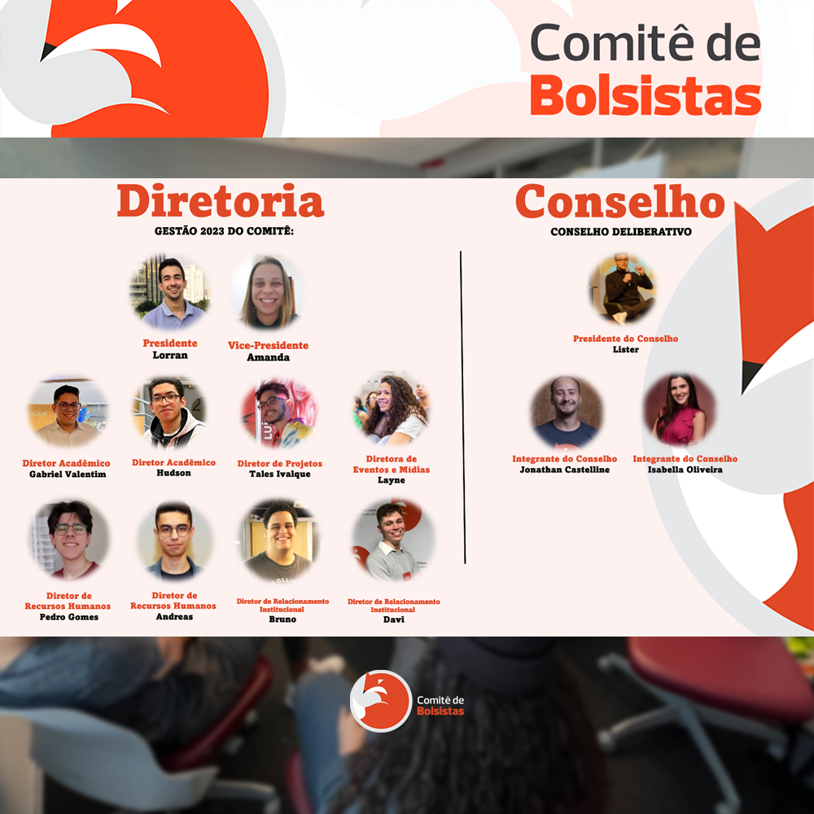

---

## Agradecimentos

Essa página demonstrou um pouco de como foi toda a trajetória de formação do Comitê de Bolsistas do Insper, desde o momento em que este era somente uma ideia até o momento em que fora realizada toda sua formação, estruturação e consolidação. A todos que contribuíram para o surgimento e sucesso da nossa tão querida organização, gostaria de deixar aqui registrado meu muito obrigado!

À atual e futuras Diretoriais e membros, conto com cada um de vocês para continuarmos tornando o Programa de Bolsas do Insper cada dia maior, mais inclusivo e melhor.

**_Com carinho,_**

**_Lister Ogusuku Ribeiro_**

_Fundador do Comitê de Bolsistas do Insper_
