## Diretoria 2023:

_A seguir, seguem as atividades realizadas até o momento pela Diretoria responsável pela Gestão do Comitê de Bolsistas em 2023:_

---

### 23.1:

#### Apoio na sala de espera dos bolsistas - Vestibular Insper 23.1

Em janeiro de 2023 os membros do Comitê de Bolsistas auxiliaram o Programa de Bolsas do Insper por meio de bate-papos com os candidatos à bolsa antes da realização das entrevistas. Durante os bate-papos, os candidatos tiveram uma maior proximidade com os alunos bolsistas e entenderam melhor como é a vida dentro da instituição.

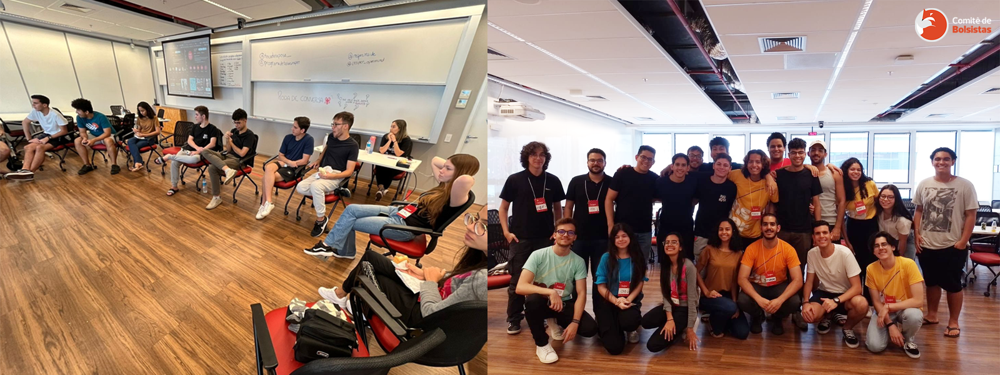

#### Almoço com a Presidência e Diretoria do Insper para recepção dos novos bolsistas

No dia 30 de janeiro de 2023 nossos Conselheiros, Jonathan e Lister, participaram do almoço de boas-vindas oferecido pelo Insper aos novos bolsistas integrais da instituição. O almoço contou com a participação do Presidente do Insper, Marcos Lisboa, além de Diretores, Gerentes e outros colaboradores da instituição.

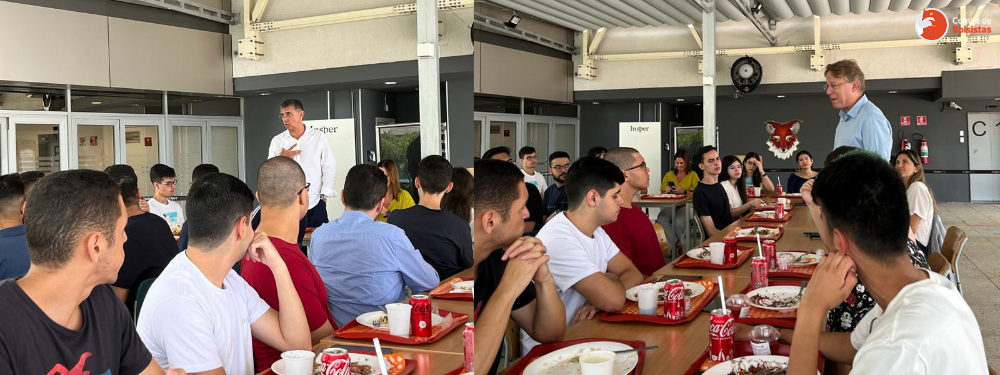

#### Primeira reunião da Diretoria

O Comitê de Bolsistas do Insper realizou no dia 11 de abril a primeira reunião de oficialização da sua Diretoria responsável pela Gestão do Comitê em 2023. A formação da nova Diretoria se deu após um longo processo de desenvolvimento do estatuto e reestruturação do Comitê, o qual teve início no final de 2022 e foi finalizado em abril de 2023. Ficamos extremamente felizes em ter essa Diretoria com tamanho anseio por tornar o Programa de Bolsas do Insper cada vez maior, mais inclusivo e melhor!

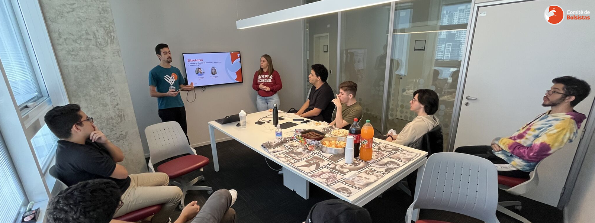
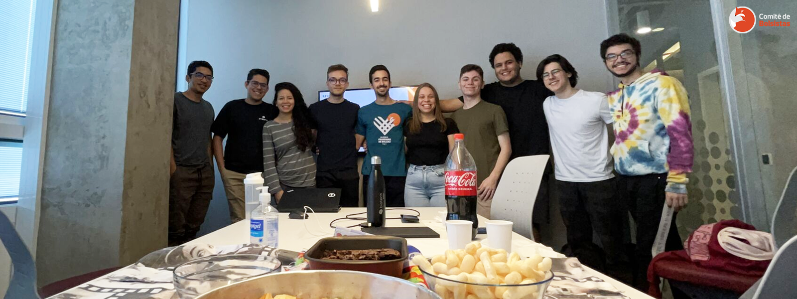

#### Reunião de novos membros do Comitê

O Comitê de Bolsistas do Insper realizou dia 18 de abril de 2023 sua primeira Assembleia Geral de apresentação da Diretoria (Gestão 2023) para os novos membros.

Na reunião os membros puderam conhecer um pouco melhor o Conselho, a Diretoria, nosso estatuto, todas as realizações do Comitê até então e projetos futuros.

Ficamos muito felizes em ver a dedicação e apoio dos nossos novos membros a essa singela causa e desejamos cada vez mais tornar o Programa de Bolsas do Insper maior, mais inclusivo e melhor.

#### Reunião da Diretoria e Conselho do Comitê com a Diretoria do Insper

No dia 26 de abril o Comitê de Bolsistas realizou uma reunião entre o Conselho Deliberativo e a Diretoria para apresentar os dois novos conselheiros, Jonathan Castelline (coordenador do Programa de Bolsas do Insper) e Isabella Oliveira (Alumni bolsista integral de Engenharia de Computação), aos membros da gestão do Comitê.

Além disso, a Gerente de Relacionamento Institucional, Ana Carolina Velasco, e o Diretor Administrativo do Insper, Marcelo Orticelli, também estiveram presentes na reunião para conhecer melhor o Conselho, a Diretoria, nossa atual estrutura e discutir planos futuros para tornar o nosso querido Programa de Bolsas cada vez maior, mais inclusivo e melhor.

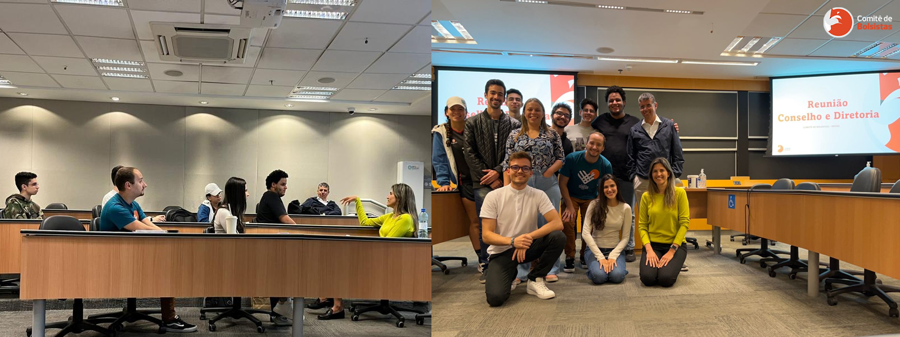

<blockquote class="instagram-media" data-instgrm-permalink="https://www.instagram.com/p/CrlsU0frBMy/?utm_source=ig_embed&amp;utm_campaign=loading" data-instgrm-version="14" style=" background:#FFF; border:0; border-radius:3px; box-shadow:0 0 1px 0 rgba(0,0,0,0.5),0 1px 10px 0 rgba(0,0,0,0.15); margin: 1px; max-width:540px; min-width:326px; padding:0; width:99.375%; width:-webkit-calc(100% - 2px); width:calc(100% - 2px);">
 <a href="https://www.instagram.com/p/CrlsU0frBMy/?utm_source=ig_embed&amp;utm_campaign=loading" style=" background:#FFFFFF; line-height:0; padding:0 0; text-align:center; text-decoration:none; width:100%;" target="_blank"> 
 

 
 

 

 
<svg width="50px" height="50px" viewBox="0 0 60 60" version="1.1" xmlns="https://www.w3.org/2000/svg" xmlns:xlink="https://www.w3.org/1999/xlink"><g stroke="none" stroke-width="1" fill="none" fill-rule="evenodd"><g transform="translate(-511.000000, -20.000000)" fill="#000000"><g><path d="M556.869,30.41 C554.814,30.41 553.148,32.076 553.148,34.131 C553.148,36.186 554.814,37.852 556.869,37.852 C558.924,37.852 560.59,36.186 560.59,34.131 C560.59,32.076 558.924,30.41 556.869,30.41 M541,60.657 C535.114,60.657 530.342,55.887 530.342,50 C530.342,44.114 535.114,39.342 541,39.342 C546.887,39.342 551.658,44.114 551.658,50 C551.658,55.887 546.887,60.657 541,60.657 M541,33.886 C532.1,33.886 524.886,41.1 524.886,50 C524.886,58.899 532.1,66.113 541,66.113 C549.9,66.113 557.115,58.899 557.115,50 C557.115,41.1 549.9,33.886 541,33.886 M565.378,62.101 C565.244,65.022 564.756,66.606 564.346,67.663 C563.803,69.06 563.154,70.057 562.106,71.106 C561.058,72.155 560.06,72.803 558.662,73.347 C557.607,73.757 556.021,74.244 553.102,74.378 C549.944,74.521 548.997,74.552 541,74.552 C533.003,74.552 532.056,74.521 528.898,74.378 C525.979,74.244 524.393,73.757 523.338,73.347 C521.94,72.803 520.942,72.155 519.894,71.106 C518.846,70.057 518.197,69.06 517.654,67.663 C517.244,66.606 516.755,65.022 516.623,62.101 C516.479,58.943 516.448,57.996 516.448,50 C516.448,42.003 516.479,41.056 516.623,37.899 C516.755,34.978 517.244,33.391 517.654,32.338 C518.197,30.938 518.846,29.942 519.894,28.894 C520.942,27.846 521.94,27.196 523.338,26.654 C524.393,26.244 525.979,25.756 528.898,25.623 C532.057,25.479 533.004,25.448 541,25.448 C548.997,25.448 549.943,25.479 553.102,25.623 C556.021,25.756 557.607,26.244 558.662,26.654 C560.06,27.196 561.058,27.846 562.106,28.894 C563.154,29.942 563.803,30.938 564.346,32.338 C564.756,33.391 565.244,34.978 565.378,37.899 C565.522,41.056 565.552,42.003 565.552,50 C565.552,57.996 565.522,58.943 565.378,62.101 M570.82,37.631 C570.674,34.438 570.167,32.258 569.425,30.349 C568.659,28.377 567.633,26.702 565.965,25.035 C564.297,23.368 562.623,22.342 560.652,21.575 C558.743,20.834 556.562,20.326 553.369,20.18 C550.169,20.033 549.148,20 541,20 C532.853,20 531.831,20.033 528.631,20.18 C525.438,20.326 523.257,20.834 521.349,21.575 C519.376,22.342 517.703,23.368 516.035,25.035 C514.368,26.702 513.342,28.377 512.574,30.349 C511.834,32.258 511.326,34.438 511.181,37.631 C511.035,40.831 511,41.851 511,50 C511,58.147 511.035,59.17 511.181,62.369 C511.326,65.562 511.834,67.743 512.574,69.651 C513.342,71.625 514.368,73.296 516.035,74.965 C517.703,76.634 519.376,77.658 521.349,78.425 C523.257,79.167 525.438,79.673 528.631,79.82 C531.831,79.965 532.853,80.001 541,80.001 C549.148,80.001 550.169,79.965 553.369,79.82 C556.562,79.673 558.743,79.167 560.652,78.425 C562.623,77.658 564.297,76.634 565.965,74.965 C567.633,73.296 568.659,71.625 569.425,69.651 C570.167,67.743 570.674,65.562 570.82,62.369 C570.966,59.17 571,58.147 571,50 C571,41.851 570.966,40.831 570.82,37.631"></path></g></g></g></svg>

 
Ver essa foto no Instagram

 

 

 

 

 

 

 

 

 

 
 

 

</a>
<a href="https://www.instagram.com/p/CrlsU0frBMy/?utm_source=ig_embed&amp;utm_campaign=loading" style=" color:#c9c8cd; font-family:Arial,sans-serif; font-size:14px; font-style:normal; font-weight:normal; line-height:17px; text-decoration:none;" target="_blank">Uma publicação compartilhada por Insper (@insperedu)</a>

</blockquote> 

#### Homenagem de despedida ao Marcos Lisboa

No dia 8 de março de 2023 o Comitê de Bolsistas integrou e ajudou a organizar (junto à Área de Mídias do Diretório Acadêmico) a homenagem de despedida do então presidente do Insper, Marcos Lisboa.

Agradecemos imensamente ao Marcos por todas as suas contribuições junto ao Programa de Bolsas do Insper enquanto esteve à frente da presidência da instituição e desejamos uma excelente gestão por parte do nosso querido novo presidente, Marcelo Knobel.

Agradecemos, por fim, por toda contribuição para o sucesso dessa ação por parte do Lister Ogusuku Ribeiro (nosso Conselheiro), Bruno Florencio (nosso Diretor de RI), Lorran Lopes (nosso Presidente) e Amanda Ribeiro (nossa Vice-presidente).

<blockquote class="instagram-media" data-instgrm-permalink="https://www.instagram.com/reel/CpjHt5NAY4h/?utm_source=ig_embed&amp;utm_campaign=loading" data-instgrm-version="14" style=" background:#FFF; border:0; border-radius:3px; box-shadow:0 0 1px 0 rgba(0,0,0,0.5),0 1px 10px 0 rgba(0,0,0,0.15); margin: 1px; max-width:540px; min-width:326px; padding:0; width:99.375%; width:-webkit-calc(100% - 2px); width:calc(100% - 2px);">
 <a href="https://www.instagram.com/reel/CpjHt5NAY4h/?utm_source=ig_embed&amp;utm_campaign=loading" style=" background:#FFFFFF; line-height:0; padding:0 0; text-align:center; text-decoration:none; width:100%;" target="_blank"> 
 

 
 

 

 
<svg width="50px" height="50px" viewBox="0 0 60 60" version="1.1" xmlns="https://www.w3.org/2000/svg" xmlns:xlink="https://www.w3.org/1999/xlink"><g stroke="none" stroke-width="1" fill="none" fill-rule="evenodd"><g transform="translate(-511.000000, -20.000000)" fill="#000000"><g><path d="M556.869,30.41 C554.814,30.41 553.148,32.076 553.148,34.131 C553.148,36.186 554.814,37.852 556.869,37.852 C558.924,37.852 560.59,36.186 560.59,34.131 C560.59,32.076 558.924,30.41 556.869,30.41 M541,60.657 C535.114,60.657 530.342,55.887 530.342,50 C530.342,44.114 535.114,39.342 541,39.342 C546.887,39.342 551.658,44.114 551.658,50 C551.658,55.887 546.887,60.657 541,60.657 M541,33.886 C532.1,33.886 524.886,41.1 524.886,50 C524.886,58.899 532.1,66.113 541,66.113 C549.9,66.113 557.115,58.899 557.115,50 C557.115,41.1 549.9,33.886 541,33.886 M565.378,62.101 C565.244,65.022 564.756,66.606 564.346,67.663 C563.803,69.06 563.154,70.057 562.106,71.106 C561.058,72.155 560.06,72.803 558.662,73.347 C557.607,73.757 556.021,74.244 553.102,74.378 C549.944,74.521 548.997,74.552 541,74.552 C533.003,74.552 532.056,74.521 528.898,74.378 C525.979,74.244 524.393,73.757 523.338,73.347 C521.94,72.803 520.942,72.155 519.894,71.106 C518.846,70.057 518.197,69.06 517.654,67.663 C517.244,66.606 516.755,65.022 516.623,62.101 C516.479,58.943 516.448,57.996 516.448,50 C516.448,42.003 516.479,41.056 516.623,37.899 C516.755,34.978 517.244,33.391 517.654,32.338 C518.197,30.938 518.846,29.942 519.894,28.894 C520.942,27.846 521.94,27.196 523.338,26.654 C524.393,26.244 525.979,25.756 528.898,25.623 C532.057,25.479 533.004,25.448 541,25.448 C548.997,25.448 549.943,25.479 553.102,25.623 C556.021,25.756 557.607,26.244 558.662,26.654 C560.06,27.196 561.058,27.846 562.106,28.894 C563.154,29.942 563.803,30.938 564.346,32.338 C564.756,33.391 565.244,34.978 565.378,37.899 C565.522,41.056 565.552,42.003 565.552,50 C565.552,57.996 565.522,58.943 565.378,62.101 M570.82,37.631 C570.674,34.438 570.167,32.258 569.425,30.349 C568.659,28.377 567.633,26.702 565.965,25.035 C564.297,23.368 562.623,22.342 560.652,21.575 C558.743,20.834 556.562,20.326 553.369,20.18 C550.169,20.033 549.148,20 541,20 C532.853,20 531.831,20.033 528.631,20.18 C525.438,20.326 523.257,20.834 521.349,21.575 C519.376,22.342 517.703,23.368 516.035,25.035 C514.368,26.702 513.342,28.377 512.574,30.349 C511.834,32.258 511.326,34.438 511.181,37.631 C511.035,40.831 511,41.851 511,50 C511,58.147 511.035,59.17 511.181,62.369 C511.326,65.562 511.834,67.743 512.574,69.651 C513.342,71.625 514.368,73.296 516.035,74.965 C517.703,76.634 519.376,77.658 521.349,78.425 C523.257,79.167 525.438,79.673 528.631,79.82 C531.831,79.965 532.853,80.001 541,80.001 C549.148,80.001 550.169,79.965 553.369,79.82 C556.562,79.673 558.743,79.167 560.652,78.425 C562.623,77.658 564.297,76.634 565.965,74.965 C567.633,73.296 568.659,71.625 569.425,69.651 C570.167,67.743 570.674,65.562 570.82,62.369 C570.966,59.17 571,58.147 571,50 C571,41.851 570.966,40.831 570.82,37.631"></path></g></g></g></svg>

 
Ver essa foto no Instagram

 

 

 

 

 

 

 

 

 

 
 

 

</a>
<a href="https://www.instagram.com/reel/CpjHt5NAY4h/?utm_source=ig_embed&amp;utm_campaign=loading" style=" color:#c9c8cd; font-family:Arial,sans-serif; font-size:14px; font-style:normal; font-weight:normal; line-height:17px; text-decoration:none;" target="_blank">Uma publicação compartilhada por Inside Insper (@insperinside)</a>

</blockquote> 

#### Aulas de Apoio Acadêmico de Engenharia

Na noite do dia 20 de março de 2023, nosso Diretor Acadêmico e aluno do 5º semestre do curso de Engenharia de Computação, Gabriel Valentim, ministrou uma aula voluntária de apoio aos estudantes do ciclo básico das Engenharias Insper que passarão por avaliações de programação nos próximos dias. Além disso, o conteúdo da aula também envolve o tema "Reinforcement Learning", atraindo estudantes de semestres mais avançados para acompanhar as explicações do Gabriel e aprender um pouco mais sobre o universo da tecnologia.

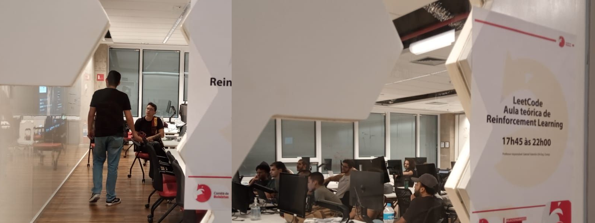

#### Aulas de Apoio Acadêmico de Engenharia

Na noite do dia 21 de março de 2023, nosso membro da área do Apoio Acadêmico e aluno do curso de Engenharia de Computação, Vinícius R., e o estudante Pedro Ivo ministraram uma aula voluntária de apoio aos estudantes do ciclo básico das Engenharias Insper que passarão por uma avaliação da disciplina Design de Software amanhã.

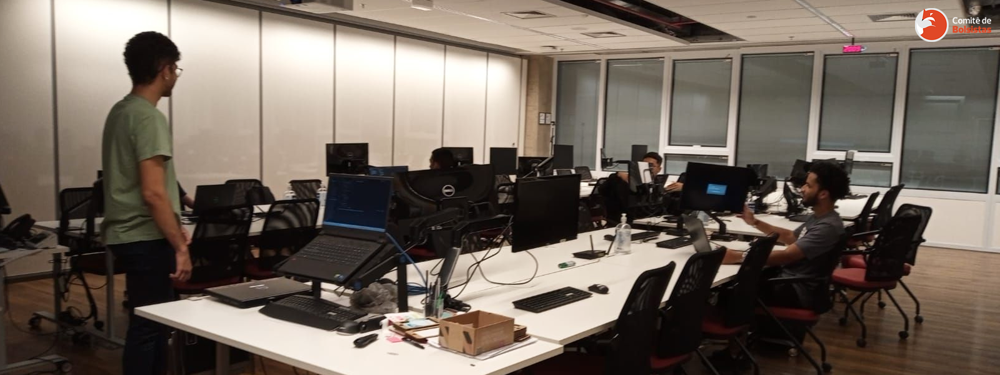

#### Aulas de Apoio Acadêmico de Direito

No dia 24 de março de 2023, nosso Diretor de Relacionamento Institucional e estudante de Direito no Insper, Davi Souza Diniz, realizou uma aula de revisão para bolsistas do curso de Direito visando prepara-los para as avaliações intermediárias do Insper.

O foco das aulas foi em torno das disciplinas "Democracia e Constituição" e "Introdução ao Estudo do Direito".

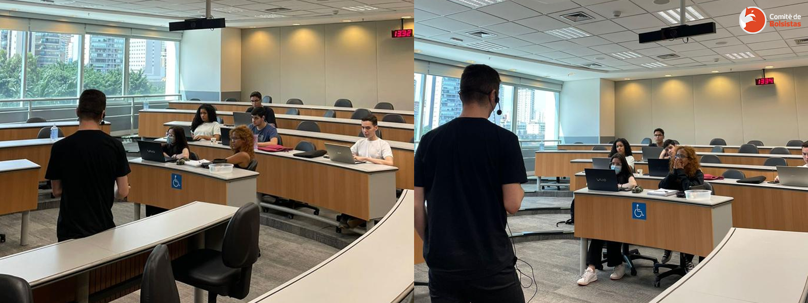

#### Cursinho Insper visita a Toca da Raposa

No dia 25 de março de 2023, nosso Diretor de Relacionamento Institucional, Bruno Florencio, viabilizou a integração dos bolsistas moradores da Toca da Raposa (residencial estudantil de bolsistas integrais do Insper) com os membros do Cursinho Insper, organização estudantil focada em auxiliar jovens de baixa renda a terem acesso à educação de qualidade.
Agradecemos todos os membros do Cursinho pelo apoio e esperamos realizar cada vez mais momentos de integração como esse.

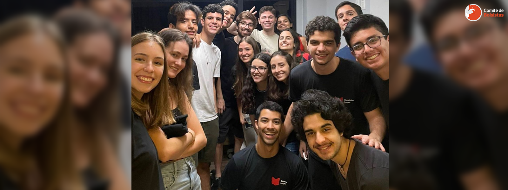

#### Participação no bate-papo com Marcelo Knobel, presidente do Insper

No dia 14 de abril de 2023 alguns membros da Diretoria e Conselho do Comitê de Bolsistas participaram do bate-papo com o novo presidente do Insper, Marcelo Knobel. Durante o bate-papo, os estudantes apresentaram a Marcelo pontos e questionamentos que consideraram relevantes no que tange a Comunidade Bolsista e Programa de Bolsas do Insper.

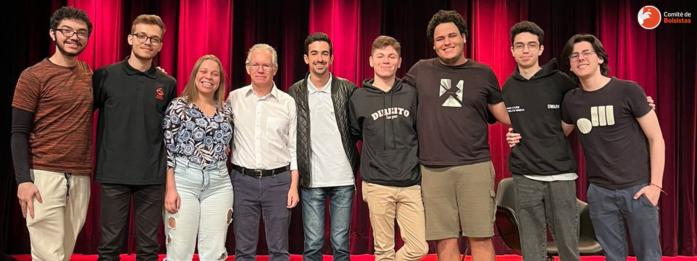

#### OpenMind Talks | Evento sobre Intercâmbio

O Comitê de Bolsistas realizou no dia 12 de maio de 2023 a primeira edição do OpenMind Talks, evento que reuniu bolsistas que já fizeram intercâmbio durante a graduação para compartilhar suas experiências e dicas com os atuais bolsistas parciais e integrais do Insper .

O evento contou com a participação da Isabella Oliveira, alumni de Engenharia de Computação e atual conselheira do Comitê de Bolsistas, Isabella Godoy (Economia 2022.2), Pedro Cândido (Administração 2022.2) e Victória Tuane (Economia 2019.2).

Agradecemos imensamente por toda participação dos membros da Comunidade Bolsista e esperamos trazer até vocês cada vez mais eventos que agreguem a todos os bolsistas do Insper.

<iframe width="1351" height="480" src="https://www.youtube.com/embed/lf1p7os9sDQ" title="OpenMind Talks - Comitê de Bolsistas Insper" frameborder="0" allow="accelerometer; autoplay; clipboard-write; encrypted-media; gyroscope; picture-in-picture; web-share" allowfullscreen></iframe>

#### Divulgação de intercâmbio dos bolsistas

Nossa área de Eventos e Mídias em parceria com o Relacionamento Institucional realizou, ao longo do semestre, a divulgação massiva de vaquinhas de arrecadação dos nossos bolsistas que vão fazer intercâmbio em 2023.2. Observamos que era de fundamental importância o forte engajamento de toda Comunidade Bolsista para que houvesse o maior alcance e arrecadação possível nas vaquinhas de todos. Para isso, utilizamos nossos meios de comunicação oficiais (como o e-mail institucional, LinkedIn e Instagram do Comitê) para atingir a maior quantidade de alunos, alumni, doadores e comunidade externa ao Insper.

#### Criação do Instagram e LinkedIn do Comitê

No primeiro semestre de 2023 nossa área de Eventos e Mídias também realizou o lançamento das redes sociais do Comitê de Bolsistas. Foram criados perfis e páginas no LinkedIn e Instagram, os quais em pouco tempo alcançaram números expressivos de seguidores e compartilhamentos nas publicações.

#### Arraiá da Toca

No dia 8 de junho de 2023 foi realizado na Toca da Raposa o Arraiá da Toca, evento de encerramento do semestre destinado aos atuais moradores da Toca e que contou com a presença de convidados especiais do Comitê de Bolsistas e também de professores do Insper .

Agradecemos imensamente a gestão da Toca (Samuel Jabes e Fernanda Souza ) pelo convite para esse incrível evento e esperamos poder colaborar e participar de cada vez mais eventos com vocês no próximo semestre! Até lá 😄🦊❤️

<blockquote class="instagram-media" data-instgrm-captioned data-instgrm-permalink="https://www.instagram.com/reel/CtSLDEdPP_e/?utm_source=ig_embed&amp;utm_campaign=loading" data-instgrm-version="14" style=" background:#FFF; border:0; border-radius:3px; box-shadow:0 0 1px 0 rgba(0,0,0,0.5),0 1px 10px 0 rgba(0,0,0,0.15); margin: 1px; max-width:540px; min-width:326px; padding:0; width:99.375%; width:-webkit-calc(100% - 2px); width:calc(100% - 2px);">
 <a href="https://www.instagram.com/reel/CtSLDEdPP_e/?utm_source=ig_embed&amp;utm_campaign=loading" style=" background:#FFFFFF; line-height:0; padding:0 0; text-align:center; text-decoration:none; width:100%;" target="_blank"> 
 

 
 

 

 
<svg width="50px" height="50px" viewBox="0 0 60 60" version="1.1" xmlns="https://www.w3.org/2000/svg" xmlns:xlink="https://www.w3.org/1999/xlink"><g stroke="none" stroke-width="1" fill="none" fill-rule="evenodd"><g transform="translate(-511.000000, -20.000000)" fill="#000000"><g><path d="M556.869,30.41 C554.814,30.41 553.148,32.076 553.148,34.131 C553.148,36.186 554.814,37.852 556.869,37.852 C558.924,37.852 560.59,36.186 560.59,34.131 C560.59,32.076 558.924,30.41 556.869,30.41 M541,60.657 C535.114,60.657 530.342,55.887 530.342,50 C530.342,44.114 535.114,39.342 541,39.342 C546.887,39.342 551.658,44.114 551.658,50 C551.658,55.887 546.887,60.657 541,60.657 M541,33.886 C532.1,33.886 524.886,41.1 524.886,50 C524.886,58.899 532.1,66.113 541,66.113 C549.9,66.113 557.115,58.899 557.115,50 C557.115,41.1 549.9,33.886 541,33.886 M565.378,62.101 C565.244,65.022 564.756,66.606 564.346,67.663 C563.803,69.06 563.154,70.057 562.106,71.106 C561.058,72.155 560.06,72.803 558.662,73.347 C557.607,73.757 556.021,74.244 553.102,74.378 C549.944,74.521 548.997,74.552 541,74.552 C533.003,74.552 532.056,74.521 528.898,74.378 C525.979,74.244 524.393,73.757 523.338,73.347 C521.94,72.803 520.942,72.155 519.894,71.106 C518.846,70.057 518.197,69.06 517.654,67.663 C517.244,66.606 516.755,65.022 516.623,62.101 C516.479,58.943 516.448,57.996 516.448,50 C516.448,42.003 516.479,41.056 516.623,37.899 C516.755,34.978 517.244,33.391 517.654,32.338 C518.197,30.938 518.846,29.942 519.894,28.894 C520.942,27.846 521.94,27.196 523.338,26.654 C524.393,26.244 525.979,25.756 528.898,25.623 C532.057,25.479 533.004,25.448 541,25.448 C548.997,25.448 549.943,25.479 553.102,25.623 C556.021,25.756 557.607,26.244 558.662,26.654 C560.06,27.196 561.058,27.846 562.106,28.894 C563.154,29.942 563.803,30.938 564.346,32.338 C564.756,33.391 565.244,34.978 565.378,37.899 C565.522,41.056 565.552,42.003 565.552,50 C565.552,57.996 565.522,58.943 565.378,62.101 M570.82,37.631 C570.674,34.438 570.167,32.258 569.425,30.349 C568.659,28.377 567.633,26.702 565.965,25.035 C564.297,23.368 562.623,22.342 560.652,21.575 C558.743,20.834 556.562,20.326 553.369,20.18 C550.169,20.033 549.148,20 541,20 C532.853,20 531.831,20.033 528.631,20.18 C525.438,20.326 523.257,20.834 521.349,21.575 C519.376,22.342 517.703,23.368 516.035,25.035 C514.368,26.702 513.342,28.377 512.574,30.349 C511.834,32.258 511.326,34.438 511.181,37.631 C511.035,40.831 511,41.851 511,50 C511,58.147 511.035,59.17 511.181,62.369 C511.326,65.562 511.834,67.743 512.574,69.651 C513.342,71.625 514.368,73.296 516.035,74.965 C517.703,76.634 519.376,77.658 521.349,78.425 C523.257,79.167 525.438,79.673 528.631,79.82 C531.831,79.965 532.853,80.001 541,80.001 C549.148,80.001 550.169,79.965 553.369,79.82 C556.562,79.673 558.743,79.167 560.652,78.425 C562.623,77.658 564.297,76.634 565.965,74.965 C567.633,73.296 568.659,71.625 569.425,69.651 C570.167,67.743 570.674,65.562 570.82,62.369 C570.966,59.17 571,58.147 571,50 C571,41.851 570.966,40.831 570.82,37.631"></path></g></g></g></svg>

 
Ver essa foto no Instagram

 

 

 

 

 

 

 

 

 

 
 

 

</a>
<a href="https://www.instagram.com/reel/CtSLDEdPP_e/?utm_source=ig_embed&amp;utm_campaign=loading" style=" color:#c9c8cd; font-family:Arial,sans-serif; font-size:14px; font-style:normal; font-weight:normal; line-height:17px; text-decoration:none;" target="_blank">Uma publicação compartilhada por Comitê de Bolsistas Insper (@bolsistasinsper)</a>

</blockquote> 

#### Reunião de encerramento do semestre e próximos passos

No dia 16 de julho de 2023 foi realizada a reunião de encerramento do semestre com a Diretoria e o Conselho com a definição dos próximos passos do Comitê para o segundo semestre. Algumas das pautas discutidas foram em torno da realização de novos eventos, atividades de integração com os calouros, revisão de pontos do estatuto e panoramas gerais do que deu certo e do que não deu ao longo do semestre e como melhorar. A reunião durou 2 horas e outras pautas ficaram a ser definidas na próxima reunião, a ser realizada na semana seguinte.

#### Anúncio da aprovação dos novos bolsistas

No dia 18 de julho de 2023 alguns membros do Comitê de Bolsistas foram convidados para realizar o anúncio da aprovação dos novos bolsistas no Insper. Foram momentos de muita emoção que sempre nos deixam honrados em participar.

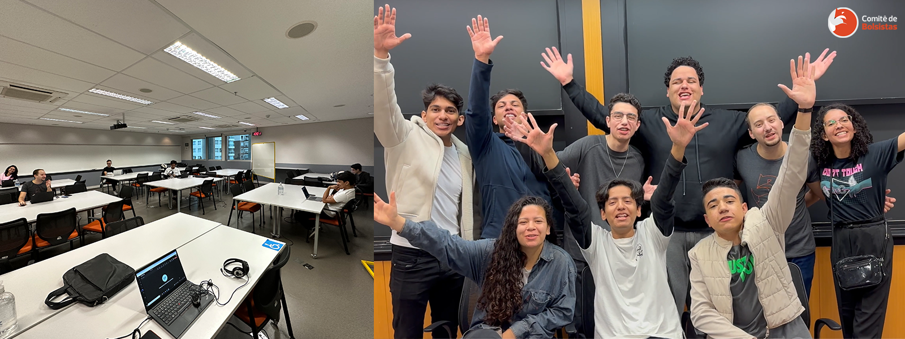

<iframe width="1351" height="480" src="https://www.youtube.com/embed/iZ2t7tFo3O4" title="Bem vindos ao Insper - 2023.2" frameborder="0" allow="accelerometer; autoplay; clipboard-write; encrypted-media; gyroscope; picture-in-picture; web-share" allowfullscreen></iframe>

---

### 23.2:

#### Revisão do estatuto

Antes mesmo do início do semestre, foi iniciado o projeto de revisão do estatuto do Comitê. A revisão está sendo coordenada pelo Diretor de Relacionamento Institucional e estudante de Direito, [**Davi Souza Diniz**](https://www.linkedin.com/in/davisdiniz/), com prazo de conclusão até dezembro de 2023.

#### Eleição à vice-presidência do Comitê em 2023.2

<iframe src="https://www.slideshare.net/slideshow/embed_code/key/GdfIGDeweXlUie?hostedIn=slideshare&page=upload" width="720" height="500" frameborder="0" marginwidth="0" marginheight="0" scrolling="no"></iframe>

Ao final de julho de 2023 o atual presidente do Comitê de Bolsistas, [Lorran Lopes](https://www.linkedin.com/in/lorranlopes/), teve que deixar a presidência da organização para a realização de um intercâmbio na Alemanha. Com isso, [Amanda Ribeiro](https://www.linkedin.com/in/amandaribeirosilva/), vice de Lorran, assumiu a presidência do Comitê, tal como previa o estatuto original da organização.

Com a ascensão de Amanda ao cargo de presidente, houve vacância no cargo de vice e foi aberto um processo eleitoral interno para que algum dos diretores se tornasse o novo vice-presidente do Comitê. Candidataram-se 3 diretores, sendo eles (em ordem de candidatura): [Layne Pereira da Silva](https://www.linkedin.com/in/laynesilva21/) (Diretora de Marketing, Eventos e Mídias), [Tales Ivalque](https://www.linkedin.com/in/tales-ivalque/) (Diretor de Projetos) e [Davi Souza Diniz](https://www.linkedin.com/in/davisdiniz/) (Diretor de Relacionamento Institucional).

O processo eleitoral se deu no dia 30 de julho, com apresentação de cartas motivacionais por parte dos candidatos, sabatinas individuais e debate entre os diretores antes da votação oficial. Antes do início oficial do processo, o candidato Tales Ivalque comunicou a Diretoria Executiva em exercício que gostaria de deixar o processo eleitoral. A votação dos Conselheiros e Diretores foi conduzida e fiscalizada pelo Presidente do Conselho Deliberativo, Lister Ogusuku Ribeiro.

O processo eleitoral foi acirrado, com uma diferença de apenas 2 votos entre os candidatos. A divulgação do resultado se deu pelo Presidente do Conselho à Diretoria Executiva na manhã seguinte, a qual comunicou os candidatos e, em seguida, os Diretores e demais membros do Comitê.

<blockquote class="instagram-media" data-instgrm-captioned data-instgrm-permalink="https://www.instagram.com/p/CvchajCrUIj/?utm_source=ig_embed&amp;utm_campaign=loading" data-instgrm-version="14" style=" background:#FFF; border:0; border-radius:3px; box-shadow:0 0 1px 0 rgba(0,0,0,0.5),0 1px 10px 0 rgba(0,0,0,0.15); margin: 1px; max-width:540px; min-width:326px; padding:0; width:99.375%; width:-webkit-calc(100% - 2px); width:calc(100% - 2px);">
 <a href="https://www.instagram.com/p/CvchajCrUIj/?utm_source=ig_embed&amp;utm_campaign=loading" style=" background:#FFFFFF; line-height:0; padding:0 0; text-align:center; text-decoration:none; width:100%;" target="_blank"> 
 

 
 

 

 
<svg width="50px" height="50px" viewBox="0 0 60 60" version="1.1" xmlns="https://www.w3.org/2000/svg" xmlns:xlink="https://www.w3.org/1999/xlink"><g stroke="none" stroke-width="1" fill="none" fill-rule="evenodd"><g transform="translate(-511.000000, -20.000000)" fill="#000000"><g><path d="M556.869,30.41 C554.814,30.41 553.148,32.076 553.148,34.131 C553.148,36.186 554.814,37.852 556.869,37.852 C558.924,37.852 560.59,36.186 560.59,34.131 C560.59,32.076 558.924,30.41 556.869,30.41 M541,60.657 C535.114,60.657 530.342,55.887 530.342,50 C530.342,44.114 535.114,39.342 541,39.342 C546.887,39.342 551.658,44.114 551.658,50 C551.658,55.887 546.887,60.657 541,60.657 M541,33.886 C532.1,33.886 524.886,41.1 524.886,50 C524.886,58.899 532.1,66.113 541,66.113 C549.9,66.113 557.115,58.899 557.115,50 C557.115,41.1 549.9,33.886 541,33.886 M565.378,62.101 C565.244,65.022 564.756,66.606 564.346,67.663 C563.803,69.06 563.154,70.057 562.106,71.106 C561.058,72.155 560.06,72.803 558.662,73.347 C557.607,73.757 556.021,74.244 553.102,74.378 C549.944,74.521 548.997,74.552 541,74.552 C533.003,74.552 532.056,74.521 528.898,74.378 C525.979,74.244 524.393,73.757 523.338,73.347 C521.94,72.803 520.942,72.155 519.894,71.106 C518.846,70.057 518.197,69.06 517.654,67.663 C517.244,66.606 516.755,65.022 516.623,62.101 C516.479,58.943 516.448,57.996 516.448,50 C516.448,42.003 516.479,41.056 516.623,37.899 C516.755,34.978 517.244,33.391 517.654,32.338 C518.197,30.938 518.846,29.942 519.894,28.894 C520.942,27.846 521.94,27.196 523.338,26.654 C524.393,26.244 525.979,25.756 528.898,25.623 C532.057,25.479 533.004,25.448 541,25.448 C548.997,25.448 549.943,25.479 553.102,25.623 C556.021,25.756 557.607,26.244 558.662,26.654 C560.06,27.196 561.058,27.846 562.106,28.894 C563.154,29.942 563.803,30.938 564.346,32.338 C564.756,33.391 565.244,34.978 565.378,37.899 C565.522,41.056 565.552,42.003 565.552,50 C565.552,57.996 565.522,58.943 565.378,62.101 M570.82,37.631 C570.674,34.438 570.167,32.258 569.425,30.349 C568.659,28.377 567.633,26.702 565.965,25.035 C564.297,23.368 562.623,22.342 560.652,21.575 C558.743,20.834 556.562,20.326 553.369,20.18 C550.169,20.033 549.148,20 541,20 C532.853,20 531.831,20.033 528.631,20.18 C525.438,20.326 523.257,20.834 521.349,21.575 C519.376,22.342 517.703,23.368 516.035,25.035 C514.368,26.702 513.342,28.377 512.574,30.349 C511.834,32.258 511.326,34.438 511.181,37.631 C511.035,40.831 511,41.851 511,50 C511,58.147 511.035,59.17 511.181,62.369 C511.326,65.562 511.834,67.743 512.574,69.651 C513.342,71.625 514.368,73.296 516.035,74.965 C517.703,76.634 519.376,77.658 521.349,78.425 C523.257,79.167 525.438,79.673 528.631,79.82 C531.831,79.965 532.853,80.001 541,80.001 C549.148,80.001 550.169,79.965 553.369,79.82 C556.562,79.673 558.743,79.167 560.652,78.425 C562.623,77.658 564.297,76.634 565.965,74.965 C567.633,73.296 568.659,71.625 569.425,69.651 C570.167,67.743 570.674,65.562 570.82,62.369 C570.966,59.17 571,58.147 571,50 C571,41.851 570.966,40.831 570.82,37.631"></path></g></g></g></svg>

 
Ver essa foto no Instagram

 

 

 

 

 

 

 

 

 

 
 

 

</a>
<a href="https://www.instagram.com/p/CvchajCrUIj/?utm_source=ig_embed&amp;utm_campaign=loading" style=" color:#c9c8cd; font-family:Arial,sans-serif; font-size:14px; font-style:normal; font-weight:normal; line-height:17px; text-decoration:none;" target="_blank">Uma publicação compartilhada por Comitê de Bolsistas Insper (@bolsistasinsper)</a>

</blockquote> 
